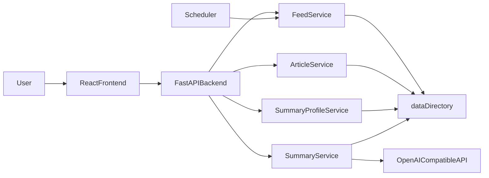

# Architecture overview

This document describes the target architecture and boundaries of RSSight, so that future feature iterations follow a consistent design.

## Layers

- `frontend/`: User interaction and page state management. React Router for home, feed management, article list, article summary, and summary profile pages; a dedicated API client layer (`src/api/`) calls the backend and is kept separate from UI for testability.
- `backend/`: APIs, domain services, and scheduled tasks.
- `data/`: File‑based storage for feeds/articles/summaries/profiles.
- `docs/`: Architecture and process documentation.

## Target runtime flow

## File storage conventions (core)

- Feed index (recommended):
  - `data/feeds.json` — JSON object mapping feed id to feed record. Each record: `id`, `title`, `url` (required for RSS feeds, null for virtual), `feed_type` (optional, one of `"rss"` or `"virtual"`; default `"rss"` when omitted for backward compatibility). Virtual feeds represent collections (e.g. article favorites) and have empty URL and `feed_type: "virtual"`. Normal RSS feeds have a non-empty `url` and `feed_type: "rss"` (or omit `feed_type`). The scheduler and RSS fetch logic skip virtual feeds.
- Article metadata (recommended):
  - `data/feeds/{feedId}/articles/{articleId}/article.json`
- AI summary body (required):
  - `data/feeds/{feedId}/articles/{articleId}/summaries/{profileName}.md`
- AI summary metadata (recommended):
  - `data/feeds/{feedId}/articles/{articleId}/summaries/{profileName}.meta.json`
- Summary profiles (recommended):
  - `data/summary_profiles.json` — single JSON object; keys are profile names (unique). Each value is an object: `name`, `base_url`, `key`, `model`, `fields` (array of strings), `prompt_template`. Name uniqueness is enforced on create.

## Key behavioral constraints

- Deleting a feed must delete the entire directory for that feed.
- Deleting or editing a summary profile must delete all summary markdown files and metadata with the same profile name across all feeds and articles.
- Scheduler failures must be isolated: failure on a single feed must not block other feeds.
- All external calls (RSS, AI, etc.) must be replaceable and mockable.

## Scheduler

- `FeedFetchScheduler` (in `app.services.scheduler`) runs in a background thread.
- On startup (FastAPI lifespan), the app creates an `ArticleService` and a scheduler that calls `article_service.fetch_and_persist_all_feeds` at a fixed interval (default 300 seconds).
- Manual triggers (e.g. a future per-feed refresh API) and the scheduled task share the same fetch logic; both can run without conflict.
- If the scheduled job raises, the scheduler logs the exception and continues to the next run.

## Non‑goals (current stage)

- No production‑grade authentication or multi‑tenancy.
- No database.
- No complex caching or message queues.
