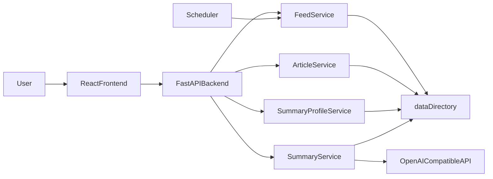

# Architecture overview

This document describes the target architecture and boundaries of WebRSSReader, so that future feature iterations follow a consistent design.

## Layers

- `frontend/`: User interaction and page state management.
- `backend/`: APIs, domain services, and scheduled tasks.
- `data/`: File‑based storage for feeds/articles/summaries/profiles.
- `docs/`: Architecture and process documentation.

## Target runtime flow

## File storage conventions (core)

- Feed index (recommended):
  - `data/feeds.json`
- Article metadata (recommended):
  - `data/feeds/{feedId}/articles/{articleId}/article.json`
- AI summary body (required):
  - `data/feeds/{feedId}/articles/{articleId}/summaries/{profileName}.md`
- AI summary metadata (recommended):
  - `data/feeds/{feedId}/articles/{articleId}/summaries/{profileName}.meta.json`
- Summary profiles (recommended):
  - `data/summary_profiles.json`

## Key behavioral constraints

- Deleting a feed must delete the entire directory for that feed.
- Deleting or editing a summary profile must delete all summary markdown files and metadata with the same profile name across all feeds and articles.
- Scheduler failures must be isolated: failure on a single feed must not block other feeds.
- All external calls (RSS, AI, etc.) must be replaceable and mockable.

## Non‑goals (current stage)

- No production‑grade authentication or multi‑tenancy.
- No database.
- No complex caching or message queues.
