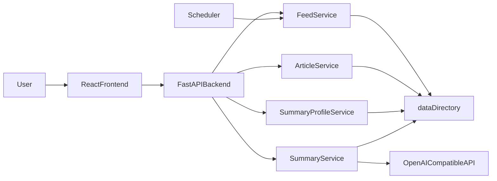

# Architecture overview

Target architecture and boundaries of RSSight for consistent feature iterations.
Authoritative engineering rules and deletion semantics are in `AGENTS.md`.

## Product information architecture

- **Top-level navigation entries** (single row): **RSS订阅**, **文章收藏**. **摘要设置** appears in the page header (top right).
- **Article Favorites (文章收藏)** is a standalone page, not a sub-section of RSS Subscriptions.
- No permission-based visibility rules; all entries are always visible.
- No backward-compatibility redirects between RSS Subscriptions and Article Favorites.

## Layers

- `frontend/`: React Router SPA. Dedicated API client layer (`src/api/`) separated from UI components. Telemetry (`src/telemetry.ts`) emits `entry_click` and `page_view` events. Article Favorites follows the same page-level layout skeleton as RSS Subscriptions.
- `backend/`: FastAPI routes, domain services, and scheduled tasks.
- `data/`: File-based runtime storage (feeds, articles, summaries, profiles). May be a symbolic link; must contain only runtime data.
- `docs/`: Architecture and process documentation.

### Frontend routes

| Path | Page | Description |
|------|------|-------------|
| `/` | Home | Top-level nav to RSS订阅, 文章收藏; 摘要设置 in header. |
| `/feeds` | Feed Management (RSS订阅) | RSS subscriptions list and management. |
| `/favorites` | Article Favorites (文章收藏) | Standalone page for favorites collections (virtual feeds). |
| `/feeds/:feedId/articles` | Article List | Articles for a feed (RSS or virtual). Back link targets source page. |
| `/feeds/:feedId/articles/:articleId` | Article Summary | Single article and summary UI. Back navigation uses browser history. |
| `/profiles` | Summary Settings (摘要设置) | Summary profile management. |

## Target runtime flow

## File storage conventions

- **Feed index:** `data/feeds.json` — JSON object mapping feed ID to record (`id`, `title`, `url`, `feed_type`). `feed_type` is `"rss"` (default) or `"virtual"`. Virtual feeds have empty URL; scheduler and fetch logic skip them.
- **Article metadata:** `data/feeds/{feedId}/articles/{articleId}/article.json` — same path for RSS-sourced and custom articles. Required fields: `id`, `feed_id`, `title`, `link`, `description`, `published_at`. Optional: `guid`, `title_trans`, `source`. When persisting JSON that includes `published_at`, the backend skips rewriting the file if the only changes would be `published_at` values (including nested keys), so git-backed `data/` does not pick up timestamp-only RSS churn.
- **AI summary body:** `data/feeds/{feedId}/articles/{articleId}/summaries/{profileName}.md`
- **AI summary metadata:** `data/feeds/{feedId}/articles/{articleId}/summaries/{profileName}.meta.json`
- **Summary profiles:** `data/summary_profiles.json` — single JSON object keyed by profile name. Each value: `name`, `base_url`, `key`, `model`, `fields`, `prompt_template`.
- **Read-later collection:** `data/read_later.json` — `{ "items": [ { "feed_id", "article_id", "added_at" } ] }`. Ordered newest-added first. Reference-only; no duplicated article content.

## Scheduler

- `FeedFetchScheduler` (in `app.services.scheduler`) runs in a background thread.
- On startup (FastAPI lifespan):
  - One data repository sync cycle runs first (see Data Repository Sync below).
  - Creates an `ArticleService` and scheduler calling `article_service.fetch_and_persist_all_feeds` at a fixed interval (default 300 s).
- Manual triggers and the scheduled task share the same fetch logic.
- If the scheduled job raises, the scheduler logs the exception and continues.

## Data Repository Sync

- `DataRepoSyncService` (in `app.services.data_sync`) synchronizes the `data/` directory with a git remote.
- Runs once at backend startup, before the feed fetch scheduler starts.
- A recurring scheduler runs sync every 30 minutes for continuous synchronization.
- Sync flow:
  1. Resolve symlink target if `data/` is a symlink.
  2. Verify the directory is a git repository with an `origin` remote.
  3. Pull with rebase from remote.
  4. If local changes exist, stage, commit, and push.
- Failures are logged with actionable messages and do not crash the app (startup remains resilient).
- Exceptions in scheduled runs are logged and do not terminate future cycles.

## Non-goals (current stage)

- No production-grade authentication or multi-tenancy.
- No database.
- No complex caching or message queues.
