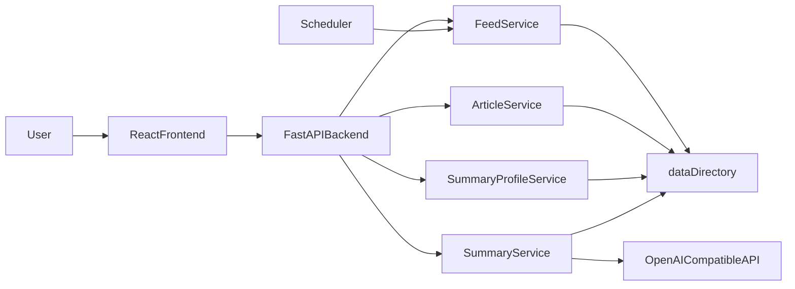

# Architecture overview

This document describes the target architecture and boundaries of RSSight, so that future feature iterations follow a consistent design.

## Product information architecture (top-level navigation)

- **Top-level entry labels and order** are deterministic in a single row: **RSS订阅**, **文章收藏**, **摘要设置** (exactly three peer entries).
- **Article Favorites (文章收藏)** is a standalone **page domain**: it has its own top-level entry and dedicated page. It is not a sub-block or in-page section of the RSS Subscriptions (RSS订阅) page.
- **No permission-based visibility rule** is required for the Article Favorites entry or page; the entry is always visible.
- **Refactor boundary:** No backward-compatibility redirect, alias route, or legacy in-page entry to Article Favorites is preserved. After the split, RSS Subscriptions and Article Favorites are independent pages only; there is no redirect from old paths and no in-page “favorites” block on the RSS Subscriptions page.

## Layers

- `frontend/`: User interaction and page state management. React Router for home, RSS Subscriptions (feed management), Article Favorites (standalone page), article list, article summary, and summary profile pages; a dedicated API client layer (`src/api/`) calls the backend and is kept separate from UI for testability. The standalone Article Favorites page follows the same page-level layout and interaction skeleton as the RSS Subscriptions page (main shell, back link, title, single card with section heading, primary action button, and list). The article list page (shared for both RSS and virtual feeds) shows a back link that targets 文章收藏 when the current feed is a favorites collection (virtual) and RSS 订阅 when the feed is an RSS subscription; toolbar order (add left of refresh for virtual), row order (star, date, title, delete), and delete confirmation align between both contexts. Telemetry (`src/telemetry.ts`) emits entry_click and page_view events so analytics can distinguish usage between RSS订阅 (rss_subscriptions) and 文章收藏 (article_favorites).

### Frontend routes (contract)

| Path | Page | Description |
|------|------|-------------|
| `/` | Home | Entry point; top-level nav to RSS订阅, 文章收藏, 摘要设置. |
| `/feeds` | Feed Management (RSS订阅) | RSS subscriptions list and management. |
| `/favorites` | Article Favorites (文章收藏) | Standalone page for favorites collections (virtual feeds). |
| `/feeds/:feedId/articles` | Article List | Articles for a feed (RSS or virtual). |
| `/feeds/:feedId/articles/:articleId` | Article Summary | Single article and summary UI. |
| `/profiles` | Summary Settings (摘要设置) | Summary profile management. |

No compatibility route alias or redirect exists for historical paths; RSS Subscriptions and Article Favorites are independent pages only.
- `backend/`: APIs, domain services, and scheduled tasks.
- `data/`: File‑based storage for feeds/articles/summaries/profiles.
- `docs/`: Architecture and process documentation.

## Target runtime flow

## File storage conventions (core)

- Feed index (recommended):
  - `data/feeds.json` — JSON object mapping feed id to feed record. Each record: `id`, `title`, `url` (required for RSS feeds, null for virtual), `feed_type` (optional, one of `"rss"` or `"virtual"`; default `"rss"` when omitted for backward compatibility). Virtual feeds represent collections (e.g. article favorites) and have empty URL and `feed_type: "virtual"`. Normal RSS feeds have a non-empty `url` and `feed_type: "rss"` (or omit `feed_type`). The scheduler and RSS fetch logic skip virtual feeds.
- Feed management split: Feed management presents two top-level list domains—**RSS subscriptions** and **favorites collections**—derived from the same feed index by partitioning on `feed_type` (rss vs virtual). Storage and RSS fetch behavior for existing RSS feeds remain unchanged.
- Article metadata (recommended):
  - `data/feeds/{feedId}/articles/{articleId}/article.json`
  - Same path for both RSS-sourced and custom articles (virtual feeds). Custom article storage contract: required fields `id`, `feed_id`, `title`, `link` (may be empty string), `description`, `published_at` (ISO or parseable datetime); optional `guid`, `title_trans`, `source` (source metadata for custom articles). Custom articles are created only for virtual feeds and are persisted via `ArticleService.create_custom_article`; they are loaded and rendered by the same article list/get APIs as RSS articles. When creating with a URL and missing fields, `app.services.url_autofill` runs at most once per create request and fills only empty title/description/published_at (user values are never overwritten). If title or description remain empty after extraction, creation is rejected (S043). Time precedence: user input &gt; URL extracted &gt; default now.
- AI summary body (required):
  - `data/feeds/{feedId}/articles/{articleId}/summaries/{profileName}.md`
- AI summary metadata (recommended):
  - `data/feeds/{feedId}/articles/{articleId}/summaries/{profileName}.meta.json`
- Summary profiles (recommended):
  - `data/summary_profiles.json` — single JSON object; keys are profile names (unique). Each value is an object: `name`, `base_url`, `key`, `model`, `fields` (array of strings), `prompt_template`. Name uniqueness is enforced on create.

## Key behavioral constraints

- Deleting a feed must delete the entire directory for that feed.
- Deleting or editing a summary profile must delete all summary markdown files and metadata with the same profile name across all feeds and articles.
- Scheduler failures must be isolated: failure on a single feed must not block other feeds.
- All external calls (RSS, AI, etc.) must be replaceable and mockable.

## Scheduler

- `FeedFetchScheduler` (in `app.services.scheduler`) runs in a background thread.
- On startup (FastAPI lifespan), the app creates an `ArticleService` and a scheduler that calls `article_service.fetch_and_persist_all_feeds` at a fixed interval (default 300 seconds).
- Manual triggers (e.g. a future per-feed refresh API) and the scheduled task share the same fetch logic; both can run without conflict.
- If the scheduled job raises, the scheduler logs the exception and continues to the next run.

## Non‑goals (current stage)

- No production‑grade authentication or multi‑tenancy.
- No database.
- No complex caching or message queues.
